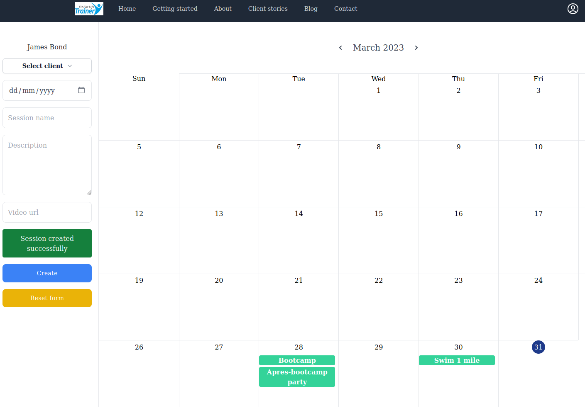
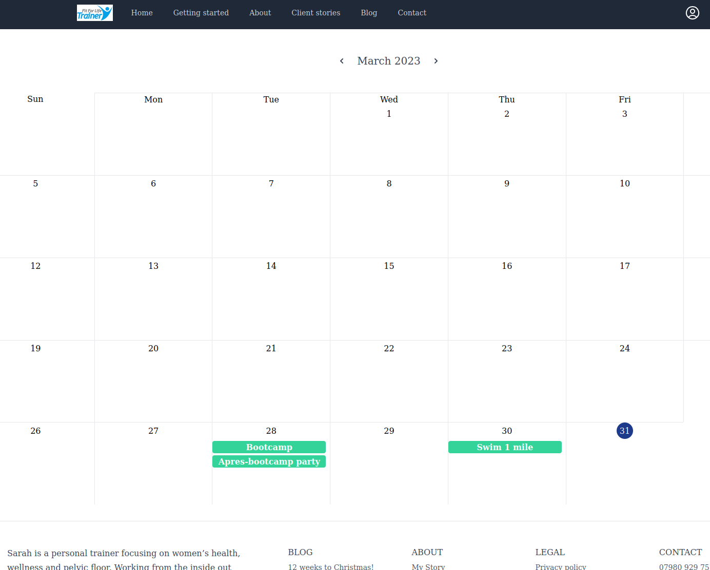
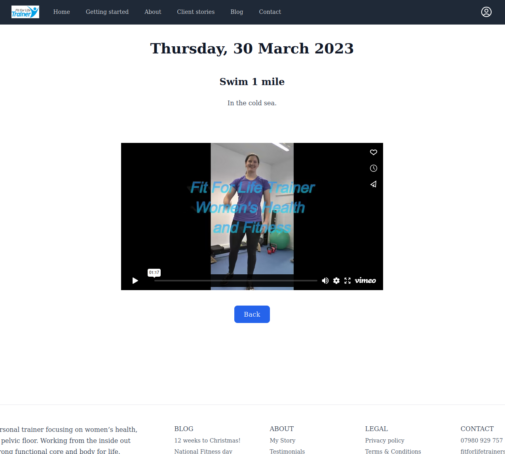

# Fit For Life Trainer &middot;  

Full stack web app for a personal trainer made with Typescript, Next.js v13, React v18, Tailwind CSS, Contentful (headless CMS) integration, PostgreSQL, and Prisma.

Site owner has complete flexibility to create and add content to new pages via Contentful, which are then statically generated (Static Site Generation), and revalidated on-demand when updated (Incremental Static Regeneration).

Features include calendar app behind login. Admin can create, update, and delete training sessions in each client's calendar.  Clients can log in to follow the assigned training sessions.

## Trainer view

## Client view

## Session page view

