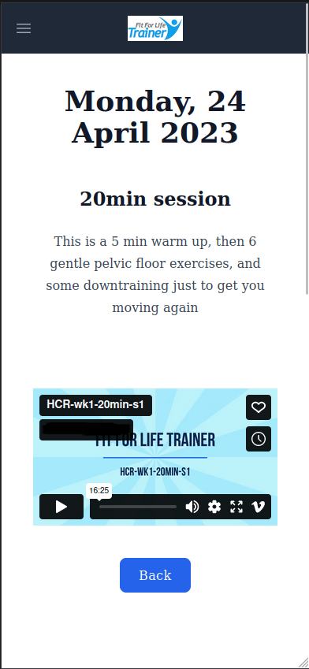

[](https://github.com/james-langridge/personal-trainer-planner/actions/workflows/ci.yml)

## About The Project

A client management and scheduling app for personal trainers and their clients, made in collaboration with a real personal trainer (PT), with the new Next.js 13 features like the [App Router](https://nextjs.org/docs/app/building-your-application/routing) and [React Server Components](https://nextjs.org/docs/getting-started/react-essentials).

> **Warning**
> This app is a work in progress, and uses new Next.js 13 and React 18 features that could be unstable.

### Features

Client in this context means the customer of the PT.

- Shared calendar between PT and each client, editable by PT only.
- Three event types:
  - Workouts, which clients can check as done.
  - Appointments, with fees for billing.
  - Bootcamps, which clients can check to confirm attendance.
- Appointment attendance and fee data is viewable in a monthly table.
- Invoices can be generated and emailed to clients with a button click.
- Mobile-friendly calendar list-view for clients with infinite scroll.
- Password-less login via email magic link.
- Custom forms via Contentful CMS, emailed to the PT when the client completes them.
- Authentication using **[NextAuth.js](https://next-auth.js.org/)**.
- ORM using **[Prisma](https://www.prisma.io/)**.
- Database on **[Railway](https://railway.app/)**.
- Styled using **[Tailwind CSS](https://tailwindcss.com/)**, **[Meraki UI](https://merakiui.com/)**, and **[shadcn/ui](https://ui.shadcn.com/)** (Radix UI, TanStack Table).
- State management with **[Redux Toolkit](https://redux-toolkit.js.org/)** and **[RTK Query](https://redux-toolkit.js.org/rtk-query/overview)**.
- Written in **TypeScript**.

### Showcase


 

## Run it locally

### Prerequisites

- You will need a database.  I used a PostgreSQL database on [Railway](https://railway.app/).
- You will need to setup an email account to work with NextAuth.js. I used Gmail.  See the [NextAuth.js](https://next-auth.js.org/providers/email) docs and the [nodemailer docs](https://nodemailer.com/usage/using-gmail/).
- The app uses Contentful as a CMS for the personal trainer to create forms for their clients, which are emailed to the PT on completion.  To use this feature you will need a [Contentful](https://www.contentful.com/sign-up/) account.

### Installation

1. Clone the repo
   ```sh
   git clone https://github.com/james-langridge/personal-trainer-planner.git
   ```

2. Install NPM packages
   ```sh
   npm install
   ```

3. Copy `.env.example` to `.env.local` and update the variables.
    ```sh
    cp .env.example .env.local
    ```

4. Generate the Prisma Client from `prisma/schema.prisma`:
    ```sh
    npx prisma generate
    ```

5. Seed the database (check comments in `prisma/seed.ts` about changing the emails):
    ```sh
    npx prisma db seed
    ```

6. Start the development server:
    ```sh
    npm run dev
    ```

## Deploy your own

You should be able to clone and deploy this project on Vercel using the button below, provided you have completed the prerequisites above (database, email, Contentful CMS).

[](https://vercel.com/new/clone?repository-url=https%3A%2F%2Fgithub.com%2Fjames-langridge%2Fpersonal-trainer-planner&env=DATABASE_URL,NEXTAUTH_SECRET,SMTP_PASSWORD,SMTP_USER,SMTP_HOST,SMTP_PORT,EMAIL_FROM,EMAIL_TO,CONTENTFUL_SPACE_ID,CONTENTFUL_ACCESS_TOKEN)

Check the deployed project has all the required environment variables, as the button generator says there cannot be more than 10 Environment Variables per project, so you will need to manually add the ones from the `.env.example` that are missing.

See the [Next.js deployment documentation](https://nextjs.org/docs/deployment) for more details.

## License

Distributed under the [MIT License](https://github.com/james-langridge/personal-trainer-planner/blob/main/LICENSE).
