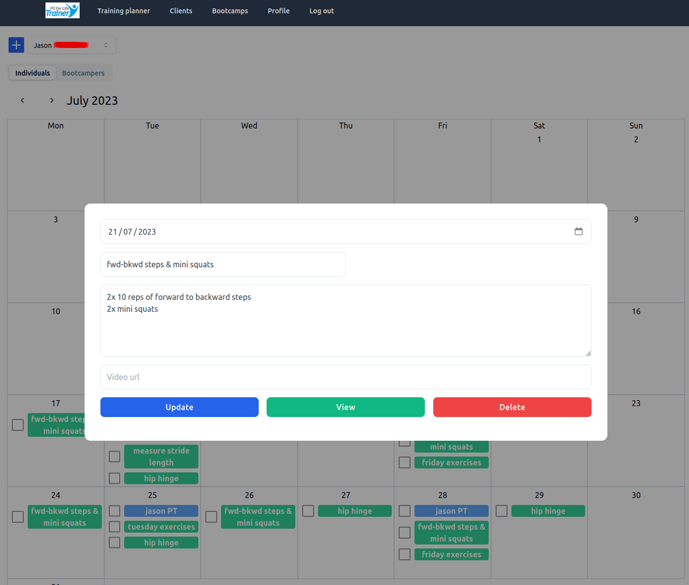

[](https://github.com/james-langridge/personal-trainer-planner/actions/workflows/ci.yml)

## About The Project

A client management and scheduling app for personal trainers (PT) and their clients, made with the new Next.js 13 features like the [App Router](https://nextjs.org/docs/app/building-your-application/routing) and [React Server Components](https://nextjs.org/docs/getting-started/react-essentials).

### Features

- PT can create new users, who can then log in via a magic link emailed to them.
- Shared and synced calendar between the PT and each user.
- PT controls all of the workout and appointment scheduling and management.
- Users can view their calendars and workouts with description and video, and check off workouts as completed.
- Mobile-friendly calendar list-view with infinite scroll for users.
- PT can view aggregated data for all users.
- PT can create custom forms in Contentful CMS, which are rendered on dynamic page routes, and emailed to the PT when the client completes them.
- [New `app` directory routing](https://nextjs.org/docs/app/building-your-application/routing).
- [Data Fetching](https://nextjs.org/docs/app/building-your-application/data-fetching), [Caching](https://nextjs.org/docs/app/building-your-application/data-fetching/caching) and [Mutation](https://nextjs.org/docs/app/building-your-application/data-fetching/server-actions).
- [Route handlers](https://nextjs.org/docs/app/building-your-application/routing/router-handlers).
- [Server and Client Components](https://nextjs.org/docs/getting-started/react-essentials).
- Authentication using **[NextAuth.js](https://next-auth.js.org/)**.
- ORM using **[Prisma](https://www.prisma.io/)**.
- Database on **[Railway](https://railway.app/)**.
- Styled using **[Tailwind CSS](https://tailwindcss.com/)**.
- Written in **TypeScript**.

### Showcase





 

## Run it locally

### Prerequisites

- You will need a database.  I used a PostgreSQL database on [Railway](https://railway.app/).
- You will need to setup an email account to work with NextAuth.js. I used Gmail.  See the [NextAuth.js](https://next-auth.js.org/providers/email) docs and the [nodemailer docs](https://nodemailer.com/usage/using-gmail/).
- The app uses Contentful as a CMS for the personal trainer to create forms for their clients, which are emailed to the PT on completion.  To use this feature you will need a [Contentful](https://www.contentful.com/sign-up/) account.

### Installation

1. Clone the repo
   ```sh
   git clone https://github.com/james-langridge/personal-trainer-planner.git
   ```

2. Install NPM packages
   ```sh
   npm install
   ```

3. Copy `.env.example` to `.env.local` and update the variables.
    ```sh
    cp .env.example .env.local
    ```

4. Generate the Prisma Client from `prisma/schema.prisma`:
    ```sh
    npx prisma generate
    ```

5. Seed the database (check comments in `prisma/seed.ts` about changing the emails):
    ```sh
    npx prisma db seed
    ```

6. Start the development server:
    ```sh
    npm run dev
    ```

## Deploy your own

You should be able to clone and deploy this project on Vercel using the button below, provided you have completed the prerequisites above (database, email, Contentful CMS).

[](https://vercel.com/new/clone?repository-url=https%3A%2F%2Fgithub.com%2Fjames-langridge%2Fpersonal-trainer-planner&env=DATABASE_URL,NEXTAUTH_SECRET,SMTP_PASSWORD,SMTP_USER,SMTP_HOST,SMTP_PORT,EMAIL_FROM,EMAIL_TO,CONTENTFUL_SPACE_ID,CONTENTFUL_ACCESS_TOKEN)

Check the deployed project has all the required environment variables, as the button generator says there cannot be more than 10 Environment Variables per project, so you will need to manually add the ones from the `.env.example` that are missing.

See the [Next.js deployment documentation](https://nextjs.org/docs/deployment) for more details.

## License

Distributed under the [MIT License](https://github.com/james-langridge/personal-trainer-planner/blob/main/LICENSE).
